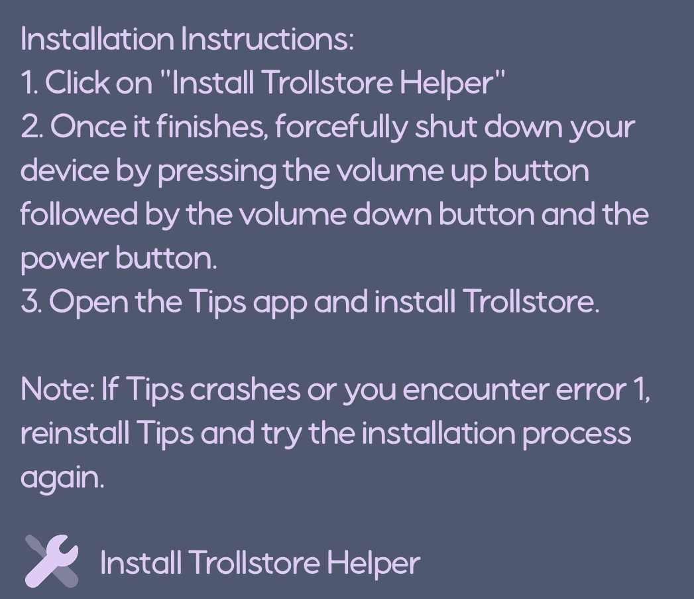

# SpiwalsIPASetup
I am on an iPhone 13 using iOS 16.6 beta one.

I use TrollStore 2 to install apps.
I use Enmity to use plugins with Discord & to use deprecated features of Tabs V2 like the amazing server list.
I use AppsDump 2 (Cracked) to dump the decrypted IPAs of apps.
I have flappy bird for if and when I get bored.
I have Filza (Cracked) to change plists without KFD tweaks.
I use yYouPlus by qnBlackCat to avoid sponsors and see dislikes. It also has s way to hide the YT Shorts tab.

# Install TrollStore 2
This install method utilizes PureKFD. iOS 14.0 - 16.7.4 is required to use PureKFD.
1. Install PureKFD with a sideloading tool. For example, sideloadly.
2. Open PureKFD.
3. Click the button named "Developer" 
4. Read the instructions which look like this :

## Links
What you're all probably here for.
[PureKFD](https://github.com/PureKFD/PureKFD)